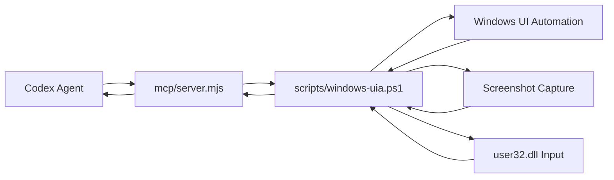

# Architecture

## Components

`windows-computer-use` is a Codex plugin with three layers:

1. Plugin layer
   - `.codex-plugin/plugin.json` declares the plugin, skills, and MCP server config.
   - `.mcp.json` registers the stdio MCP server.
   - `skills/windows-computer-use/SKILL.md` teaches Codex when and how to use the tools.

2. MCP layer
   - `mcp/server.mjs` implements a dependency-free MCP stdio server.
   - It supports line-delimited JSON and `Content-Length` framed JSON-RPC.
   - It exposes tool schemas, wiki resources, and JSON-RPC handlers.

3. Windows backend layer
   - `scripts/windows-uia.ps1` runs under Windows PowerShell in STA mode.
   - It loads `UIAutomationClient`, `UIAutomationTypes`, `System.Windows.Forms`, and `System.Drawing`.
   - It calls `user32.dll` for pointer movement, mouse buttons, and wheel actions.

## Data Flow

## Observation Model

The backend combines two observations:

- Screenshot: a PNG of the virtual screen returned as MCP image content.
- Accessibility tree: a bounded tree of UIA elements with names, roles, bounding boxes, enabled state, offscreen state, and optional metadata.

Tree traversal uses UI Automation view conditions:

- `control` is the default. It returns the practical control tree and skips offscreen nodes.
- `content` returns content-oriented nodes for reading-oriented tasks.
- `raw` returns provider internals for diagnostics.

The default tree is compact. It avoids per-node runtime id, localized type, ValuePattern, and pattern probing because those calls are expensive in large Electron/Chromium, Mozilla, WinUI, and custom-provider apps. Use `detailLevel="full"` for a rich tree or `windows_computer_use_element_info` for full metadata on one element.

Tree ids are path ids:

- `uia:active` is the active window root.
- `uia:active.0.2` is a descendant of the current active window.
- `uia:root.4` is a top-level desktop child.

Path ids are intentionally simple and explainable, but they can become stale when the UI changes. The skill tells Codex to re-observe after state changes.

For active-window workflows, the backend can bind a call to a specific top-level window using `windowTitle`, `processId`, or `nativeWindowHandle`. This avoids a common desktop automation failure where the testing shell or Codex app regains focus between observation and action. When a target is supplied, `uia:active` means the selected top-level window for that call, not necessarily the foreground window at the instant the backend starts.

Element ids are path ids inside the selected view. If an id came from a `raw` or offscreen-inclusive tree, pass the same `viewMode` and `includeOffscreen` to later `element_info`, `move`, `click`, `focus`, `invoke`, or `set_value` calls.

## Action Model

The backend supports two action classes:

- Structured UIA actions: focus, invoke, toggle, selection item, expand/collapse, and value setting.
- Coordinate actions: move, click, double click, drag, scroll, type text, and keypress.

Structured actions are preferred for normal controls because they are less sensitive to display scaling and layout movement. Coordinate actions remain necessary for custom canvas controls, games, PDF viewers, screenshots, and apps with sparse UIA trees.

## Why PowerShell

PowerShell 5.1 and .NET UI Automation are present on standard Windows installations. This keeps the plugin usable without Python packages, npm installs, native compilation, or external drivers.

The MCP server is Node because Codex on this machine already has Node and plugin MCP entrypoints commonly use command-based stdio servers.
